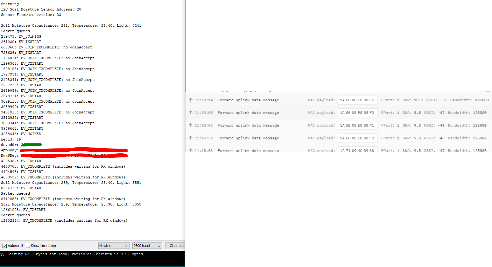
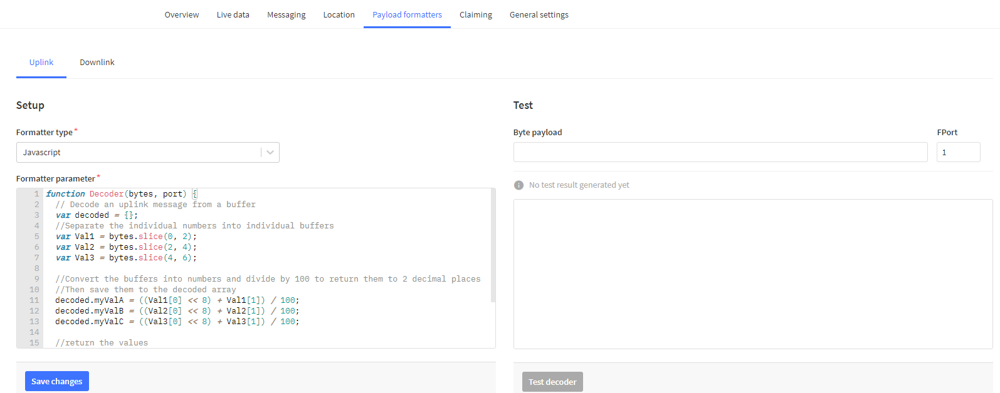

# Moisture Sensor (with SODAQ ExpLoRer)
This guide is a continuation of the `Getting Started with the SODAQ ExpLoRer Guide`  and will make use of the application (on The Things Network) and device (SODAQ ExpLoRer) set up during that guide. If you haven't followed the previous guide you will need to do that first, and  have:
- The SODAQ ExpLoRer connected correctly, with an antenna
- The SODAQ ExpLoRer connected your computer, and communicating correctly
- The Arduino IDE installed
- The `MCCI LoRaWAN LMIC library` installed and configured correctly, and
- The SODAQ ExpLoRer registered and communicating with The Things Network

## What you will need
To follow this guide, you will The setup from the previous guide, with the addition of:
- An [I2C Soil moisture sensor](https://www.tindie.com/products/miceuz/i2c-soil-moisture-sensor/).
- 4 jump wires.

You will still need to be in range of a Gateway connected to The Things Network which you can find out about [here](https://www.thethingsnetwork.org/community).

## Step 1 - Install Library
Install a library to help use the soil moisture sensor.

In the Arduino IDE:
- Go to `Tools -> Manage Libraries`
- Search for `I2CSoilMoistureSensor` using the search box
- Install the `I2CSoilMoistureSensor` library


## Step 2 - Setup the Board
Building on the setup from the setup in `Getting Started with the SODAQ ExpLoRer Guide`:

1. Using a wire connect one of the GND ports on the SODAQ ExpLoRer to the GND port on the I2C Soil moisture sensor.
1. Using a wire connect one of the SCL ports on the SODAQ ExpLoRer to the SCK/SCL port on the I2C Soil moisture sensor.
1. Using a wire connect one of the SDA ports on the SODAQ ExpLoRer to the SDA/MOSI port on the I2C Soil moisture sensor.
1. Using a wire connect one of the 5V ports on the SODAQ ExpLoRer to the VCC port on the I2C Soil moisture sensor.


## Step 3 - The Code
Now that the sensor is connected to the SODAQ ExpLoRer, the code needs to be modified from the `Getting Started with the SODAQ ExpLoRer Guide` to send the sensor data instead of the static letters in the myData variable.

> Make sure you get the code from the `Getting Started with the SODAQ ExpLoRer Guide` which importantly has the APPEUI and APPKEY configuration correct.

Under the line `#include <I2CSoilMoistureSensor.h>` at the top of the code add the following lines

```C++
#include <I2CSoilMoistureSensor.h>
#include <Wire.h>
I2CSoilMoistureSensor sensor;
```

In the `void setup()` function add `Wire.begin();` above the `loraSerial.begin(57600);` line:

```C++
void setup() {
  Wire.begin();
  loraSerial.begin(57600);
  debugSerial.begin(9600);
  ...
}
```

Replace the `pinMode(BUTTON, INPUT);` line with the following code

```C++
  sensor.begin(); // reset sensor
  delay(1000); // give some time to boot up
  debugSerial.print("I2C Soil Moisture Sensor Address: ");
  debugSerial.println(sensor.getAddress(),HEX);
  debugSerial.print("Sensor Firmware version: ");
  debugSerial.println(sensor.getVersion(),HEX);
  debugSerial.println();
```

>This will reset the soil moisture sensor and display the I2C address and firmware version in the serial monitor

Next, in the `void loop()` function replace the following code:

```C++
  // Prepare payload of 1 byte to indicate LED status
  byte payload[1];
  payload[0] = (digitalRead(BUTTON) == HIGH) ? 1 : 0;
```

With the following code:
```C++
  while (sensor.isBusy()) delay(50);
  int soilMoistureCapacitance = sensor.getCapacitance();
  int temperature = sensor.getTemperature();
  int light = sensor.getLight(true);
  sensor.sleep(); //sleep the sensor to save power

  debugSerial.print("Soil Moisture Capacitance: ");
  debugSerial.print(soilMoistureCapacitance); //read capacitance register
  debugSerial.print(", Temperature: ");
  debugSerial.print(temperature /(float)10); //temperature register
  debugSerial.print(", Light: ");
  debugSerial.println(light); //request light measurement, wait and read light register

  //Break the soilMoistureCapacitance, temperature and light into Bytes in individual buffer arrays
  byte payloadA[2];
  payloadA[0] = highByte(soilMoistureCapacitance);
  payloadA[1] = lowByte(soilMoistureCapacitance);
  byte payloadB[2];
  payloadB[0] = highByte(temperature);
  payloadB[1] = lowByte(temperature);
  byte payloadC[2];
  payloadC[0] = highByte(light);
  payloadC[1] = lowByte(light);

  //Get the size of each buffer array (in this case it will always be 2, but this could be used if they were variable)
  int sizeofPayloadA = sizeof(payloadA);
  int sizeofPayloadB = sizeof(payloadB);
  int sizeofPayloadC = sizeof(payloadC);

  //Make a buffer array big enough for all the values
  byte payload[sizeofPayloadA + sizeofPayloadB + sizeofPayloadC];

  //Add each of the individual buffer arrays the single large buffer array
  memcpy(payload, payloadA, sizeofPayloadA);
  memcpy(payload + sizeofPayloadA, payloadB, sizeofPayloadB);
  memcpy(payload + sizeofPayloadA + sizeofPayloadB, payloadC, sizeofPayloadC);
```

### What does this code do?
This code will:
1. First wait until the sensor is not busy.
1. Then it will record the soil moisture capacitance, temperature, and light readings from the sensor.
1. Next it will display the values in the serial monitor so they can be checked easily.
1. The code converts the values from numbers into a payload made of a buffer array that can be sent to The Things Network. To find out more about this process [here](https://www.thethingsnetwork.org/docs/devices/bytes.html).
1. Finally the newly created payload is queued for transmission (instead of the status of the button) to The Things Network.

### Testing
1. Connect the SODAQ ExpLoRer to your computer using the USB cable.
1. In the Arduino IDE ensure that the correct port is selected by going to `Tools -> Port:` and check that the SODAQ ExpLoRer's port is selected
1. Ensure that the correct board is selected by going to `Tools -> Board: <...> -> SODAQ SAMD (32-bits ARM Cortex-M0+) Boards -> SODAQ ExpLoRer` and selecting the SODAQ ExpLoRer.
1. Finally click the arrow button in the top left to upload your code to the Arduino.
1. You should see a 'successful upload' message in the bottom of the Arduino IDE

After it has finished uploading you can check the monitor at `Tools -> Serial Monitor` to see if it is working. You should see it connect to The Things Network, make measurements and send those measurements.

You can also now go to the `Data` tab on your The Things Network application to see the data being sent.

*Remember: Don't be worried if it fails to connect a few times*



## Step 4 - Decoding the message
Now that we have encoded the message and sent it to The Things Network we need to tell The Things Network what to do with it.

In your application on The Things Network, go to the tab named `Payload Formats`. In here we can write code to decrypt the data we get from our device.

Enter the following into the decoder:

```C++
function Decoder(bytes, port) {
  // Decode an uplink message from a buffer
  var decoded = {};
  //Separate the individual numbers into individual buffers
  var Val1 = bytes.slice(0, 2);
  var Val2 = bytes.slice(2, 4);
  var Val3 = bytes.slice(4, 6);

  //Convert the buffers into numbers and divide by 100 to return them to 2 decimal places
  //Then save them to the decoded array
  decoded.myValA = ((Val1[0] << 8) + Val1[1]);
  decoded.myValB = ((Val2[0] << 8) + Val2[1]) / 10;
  decoded.myValC = ((Val3[0] << 8) + Val3[1]);

  //return the values
  return {
    field1: decoded.myValA,
    field2: decoded.myValB,
    field3: decoded.myValC,
  };
}
```



The Code first separates the long buffer array we created in Step 3 into the buffers that make up the soil moisture capacitance, temperature, and light readings.

It then decodes each of the buffers into numbers, divides the temperature by 10 to turn it into a decimal number and saves them into the decoded array.

Finally the numbers are returned as field 1, field 2 and field 3.

**NOTE:** Click the `Save payload functions` button at the bottom of that page.

### The Decoded Message

You can also now go to the `Data` tab on your The Things Network application to see the data being sent, just like before, but now the "decoded" values are shown as well.


